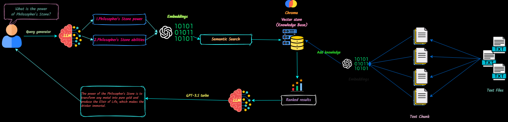

# QnA-With-RAG


## 📄 Project Description

QnA-With-RAG is a full-stack application that transforms text documents into context for Large Language Models (LLMs) to reference during chats. You can easily add, delete documents, and create multiple knowledge bases.

## 🎯 Purpose and Goals

This project aims to create a production-ready chatbot using the OpenAI API. It incorporates VectorDB and Langsmith to enhance its functionality.

## ⚙️🚀 Technologies Used


## 💡 Features

- Chat with text files
- Streaming chat
- Upload multiple text files
- Maintain a vector DB (add/delete files)
- Static API Token Authentication for ChromaDB
- Create multiple knowledge bases

## 🛠️ App Flow



## 🎬 Demo

Watch a demo of the application [here](https://github.com/Ja-yy/QnA-With-RAG/assets/114324220/9a4327a0-2fae-4456-86be-a2a50bec96b0).

## 🔜 Future Development

Future updates will include:
- React.js frontend integration
- Enhanced ChromaDB features (filtering, searching)
- Memory capabilities for the chatbot

## ▶️ Installation & Setup

1. **Clone the Repository**

   ```bash
   git clone git@github.com:Ja-yy/QnA-With-RAG.git
   ```

2. **Set Up Environment Variables**

   Create a `.env` file with the following content:

   ```plaintext
   OPENAI_API_KEY='<your_open_ai_key>'
   EMBEDDING_MODEL='text-embedding-ada-002'
   CHAT_MODEL='gpt-3.5-turbo'
   TEMPERATURE=0
   MAX_RETRIES=2
   REQUEST_TIMEOUT=15

   CHROMADB_HOST="chromadb"
   CHROMADB_PORT="8000"

   CHROMA_SERVER_AUTH_CREDENTIALS="<test-token>"
   CHROMA_SERVER_AUTH_CREDENTIALS_PROVIDER="chromadb.auth.token.TokenConfigServerAuthCredentialsProvider"
   CHROMA_SERVER_AUTH_PROVIDER="chromadb.auth.token.TokenAuthServerProvider"
   CHROMA_SERVER_AUTH_TOKEN_TRANSPORT_HEADER="AUTHORIZATION"
   ```

3. **Build and Run the Application**

   Execute the following command:

   ```bash
   docker-compose up -d --build
   ```

4. **Access the Application**

   Open your web browser and go to [localhost](http://localhost/) to start using the app.

5. **NGINX Configuration**

   - NGINX acts as a reverse proxy, routing requests to the appropriate services and handling HTTPS (if configured).
   - Ensure your NGINX configuration files are correctly set up in the `nginx` directory for optimal performance.

## 🤔 Frequently Asked Questions

- **What should I do if I encounter issues?**
  - Check the logs using `docker-compose logs` for troubleshooting.

- **How can I contribute?**
  - Feel free to open issues or submit pull requests on GitHub!

Enjoy using the app! :)
